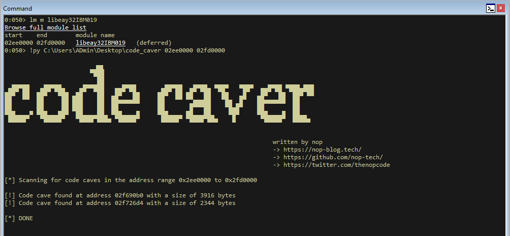

# code_caver

## Description
This script automates the tedious search process for code caves in e.g. library files. 
It will look for empty memory regions and check if the region is either protected with PAGE_EXECUTE_READ (0x20) or PAGE_EXECUTE_READWRITE (0x40).

## Limitations
This script uses Python3 and Pykd to run within WinDbg. If you are unable to execute it inside WinDbg please consider using an older release; the preview version and the most recent version (10.0.22000.194 x86) are not working!

## Usage

If not already done place pykd.dll in `C:\Program Files\Windows Kits\10\Debuggers\x86\winext` (the path varies depending on your OS and WinDbg)

1) Load Pykd inside WinDbg: `.load pykd` 
2) Obtain a memory range, e.g. by using `lm m <MODULE_NAME>`
3) Execute the script: `!py C:\Users\Admin\Desktop\code_caver.py <START_ADDRESS> <END_ADDRESS>

## Disclaimer
The script was written within a day so I have it ready for my OSED exam - pull requests with improvements are very welcome! 
